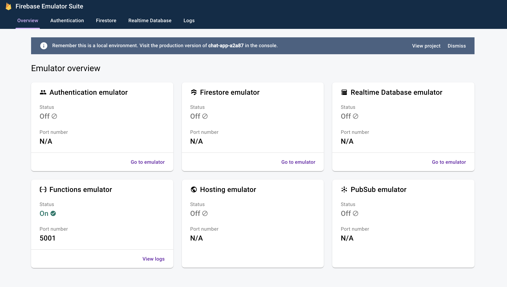

# Chat Application with React and RSuite

## Features:

- Sign in with Facebook and Google
- Link your social media accounts and create one account
- User avatar made with [React avatar editor](https://www.npmjs.com/package/react-avatar-editor)
- users can upload/edit images to their profile
- cache user avatar images for 3 days
- user can edit their nickname through the use of reusable and editable input component
- users nickname updates concurrently inside firebase storage
- Create a new chat room
- Like messages
- user online / offline
- see messages
- send a new message
- send files to chat rooms
- send audio files and play audio files
- see room information
- admin can edit room information
- broadcast message to send notification to other members
- notifications for subscribing or unsubscribing from notifications
- real-time notifications from browser
- even if the app is offline, user can get notifications
- validate user room form info with RSuite by comparing against our model Schema
- only the admin user of the room can edit the room information and the admin can grant permission to another user
- chats are grouped by dates
- pagination and scroll to bottom of the page when the user types a new message
- Ask user if they want to be notified when there is a new message

## Technologies

- [REACT SUITE UI LIBRARY](https://rsuitejs.com/guide/introduction/)
- React Context API with `useContext` hook to get the username for signin and registration
- Firebase Realtime database to store profiles, rooms, status of the user(online/offline) and messages
- Firebase Authentication with Facebook and Google
- Firebase Storage to store profile avatar image, chat images and audio
- `useRef` hook to access Canvas element for avatar image
- React Modals
- Firebase Cloud Functions to add realtime data and send notifications to the user
- [`use-context-selector`](https://github.com/dai-shi/use-context-selector) hook
- Build presence in [CLoud Firestore](https://firebase.google.com/docs/firestore/solutions/presence)
- [`useHover`](https://usehooks.com/useHover/) hook
- send realtime notifications with Cloud Messaging
- [`Service Worker`](https://firebase.google.com/docs/cloud-messaging/js/receive) to get a background notification
- [FCM cloud functions](https://firebase.google.com/docs/cloud-messaging/send-message) Send messages to multiple devices

## Installation

```bash
# application
yarn install

yarn start

# backend
cd functions

npm install

npm start

# runs on http://localhost:4000/
```


